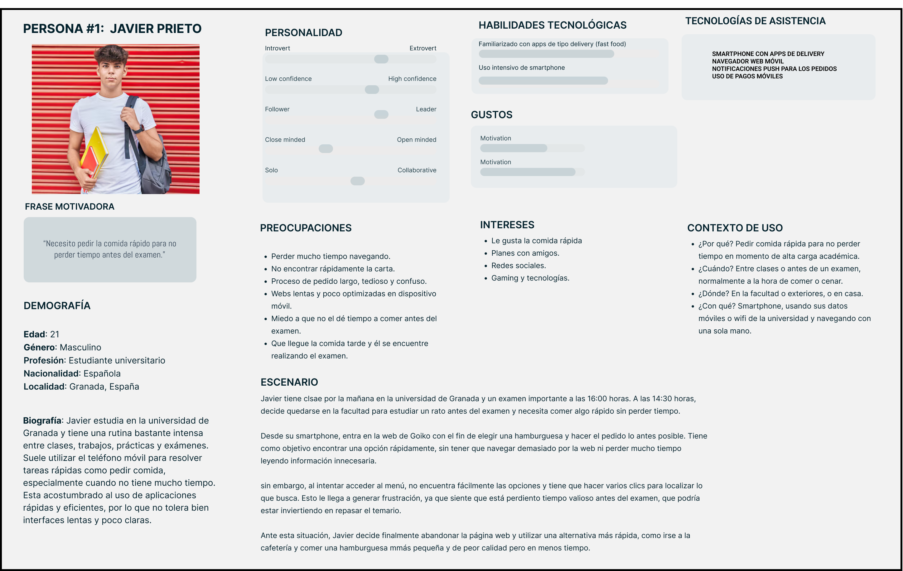
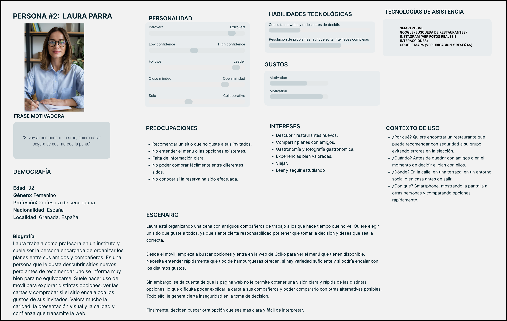

# DIU26
Prácticas Diseño Interfaces de Usuario (Tema: Fast Food Experience) 

* [Guiones de prácticas](GuionesPracticas/)
* [Guía para crea tu Case Study](Guia_CaseStudy.md)
* Sala de la Fama [DIU Hall of fame](https://github.com/mgea/DIU/tree/master/hall_of_fame) donde se pueden encontrar Case Study destacados de otros años.
* [Recursos/plantillas en figma](https://www.figma.com/design/BN2IR0q2clOSplfMmalh9K/DIU_Toolkit_Framework--2026-)

## Paso 0 My UX-Case Study
 
-----

Grupo: DIU3.cgg.  Curso: 2025/26 

Nombre del Proyecto: **Savora**

Descripción: 

>>> Describa la idea de su producto en la práctica 2 

Logotipo: 

>>> Si diseña un logotipo para su producto en la práctica 3 pongalo aqui, a un tamaño adecuado. Si diseña un slogan añadalo aquí

Miembros y nombre del equipo:
 * :bust_in_silhouette:  Cristina García Gázquez     :octocat:
 * Nombre del equipo: DIU3.cgg    
----- 

 

# Proceso de Diseño 

 

## Paso 1. UX User & Desk Research & Analisis 

### 1.a User Reseach Plan
 
-----

El presente Plan de Investigación UX tiene como objetivo llevar a cabo el análisis de la experiencia de usuario en plataformas digitales relacionadas con el sector conocido como fast food gourmet, tomando como caso principal la web de Goiko, una empresa nacional de cómida rápida especializada en hamburguesas. Este estudio se desarrolla en el contexto del crecimiento del consumo digital y del turismo urbano, donde los usuarios utilizan diariamente interfaces web para todo tipo de consultas como consultar la carta, localizar establecimientos y realizar pedidos de manera rápida y eficiente.

La metodología que se plantea combina técnicas de desk research, análisis comparativo con otras empresas competidoras del mismo sector y evaluación heurística basada en principios de usabilidad. Asimismo, se propone una selección de usuarios representativos mediante la definición de dos perfiles principales: adultos relativamente jóvenes con alta competencia digital y experiencia en pedidos online, y usuarios ocasionales o turistas que requieren de información clara antes de decidir su visita a uno de estos tipos de locales. Realizar esta segmentación permite analizar diferentes comportamientos, necesidades y expectativas durante la interacción con la interfaz.

El objetivo final del plan de investigación es identificar posibles problemas de navegación, de organización de contenidos y la visibilidad de las acciones principales, con el fin de proponer recomendaciones que puedan mejorar tanto la eficiencia como la accesibilidad y satisfacción del usuario.

[📄 Ver User Research completo](./P1/UserResearchPlan.jpg)

### 1.b Competitive Analysis
 
-----

En este análisis, se han comparado tres modelos de negocio completamente diferentes dentro del ecosistema de fast food gourmet, evaluando tanto su modelo de negocio, como su tecnología y usabilidad, además de sus puntos fuertes o débiles.

**🟣 Goiko (caso de estudio principal):** referente del sector gourmet, es considerada una cadena ya consolidada en el mercado que dispone tanto de locales físicos como de una plataforma digital que permite llevar a cabo la gestión de reservas complejas y una elección personalizada y detallada de pedidos para la función de delivery. Destaca por sus hamburguesas de autor y fuerte presencia en redes sociales.

**🟣 Vicio (referente digital):** representa el modelo nativo digital con una web ultra optimizada, centrada en la conversión rápida y un diseño visual y minimalista que elimina ampliamente cualquier tipo de fricción durante el proceso del pedido. Ha revolucionado el sector con una experiencia de usuario digital impecable y una comunicación agresiva.

**🟣 La Locura (competidor local):** es una hamburguesería local de éxito en Granada, tiene un modelo basado en la autenticidad del producto que sirve y, aunque su infraestructura digital depende de terceros y de su gran labor en redes sociales, se ha ganado popularidad por su producto "artesanal".

Sin duda, el ganador en términos de UX (Experiencia de Usuario) es Vicio debido a su reducción de fricción al mínimo, permitiendo lograr realizar un pedido en segundos mientras el usuario disfruta de una estética impecable. Aunque Goiko puede ser el más completo funcionalmente (ya que Vicio no ofrece servicio de reservas), su interfaz es excesivamente densa y puede llegar a fustrar a usuarios con prisa. La Locura es la mejor opción a nivel de producto local, pero su falta de desarrollo tecnológico conlleva una pérdida de competitividad frente a otras grandes plataformas.

### 📊 Tabla Comparativa de Competidores

| Características | **GOIKO** (Caso de Estudio) | **VICIO** | **LA LOCURA** |
| :--- | :--- | :--- | :--- |
| **Modelo de Negocio** | Local físico + Online/Delivery + Reservas  | Nativo Digital / Delivery  | Local Físico  |
| **Tecnología** | Web compleja con servicio de reservas  | Web Optimizada y minimalista  | Redes Sociales / Terceros  |
| **Precios/Necesidades** | [Precio medio-alto.Fidelización sólida  | Precio alto. Enfoque en exclusividad  | Precio competitivo. Enfoque en cercanía  |
| **Puntos Fuertes** | [Personalización y Marca  | Mejor UX/UI Minimalista y Rapidez  | Autenticidad y apoyo del púlico local  |
| **Debilidades** | Alta Carga Cognitiva, Interfaz saturada  | Sin Reservas Físicas  | Dependencia Tecnológica  |
| **Nivel de UX** | ⭐⭐⭐ (Media) | ⭐⭐⭐⭐⭐ (Excelente) | ⭐⭐ (Básica) |

### 1.c Personas
 
-----

**Perfil 1: Javier Prieto (estudiante en apuros) 👨‍💻:** estudiante de la Universidad de Granada, familiarizado con la tecnología, con alta carga de estrés por exámenes y necesita realizar un pedido de comida con mucha prisa.
👤 

**Justificación del perfil 1:** se ha seleccionado este perfil para evaluar la usabilidad móvil bajo presión. Es el conocido "test de estrés" de la web: si un usuario con prisa no puede pedir en menos de 2 minutos, la interfaz ha fallado. Representa al sector de usuarios jóvenes que sostienen el volumen de ventas diario.

**Perfil 2: Laura Parra (organizadora de planes) 👩‍🏫:** profesora de un instituto de secundaria en Granada, profesional y detallista. Le encanta hacer planes con amigos, disfrutar y organizar para ir a los mejores sitios.
👤 

**Justificación del perfil 2:** se ha seleccionado este perfil ya que permite analizar la arquitectura de la información y el sistema de reservas. Evaluamos si la web es capaz de transmitir confianza a un usuario que no solo pide o reserva comida, si no que vende la experiencia a terceros. Es clave para el posicionamiento clave de Goiko como una opción en la ciudad de Granada.

### 1.d User Journey Map
 
----

Para profundizar en la usabilidad de Goiko, se han presentado dos escenarios que representan los extremos de los comportamientos de los consumidores actuales. Estos escenarios no solo son habituales, sino que pueden llegar a definir el éxito o fracaso de una plataforma web de fast food gourmet en un entorno competitivo como la ciudad de Granada. 

**Journey Map 1 (caso Javier): la urgencia del pedido individual**

 Refleja una situación de gran presión del usuario. Es una experiencia extremadamente común en las ciudades que son universitarias: el cliente necesita comer bien, de calidad y rápidamente sin interrumpir su flujo de trabajo o estudio.
 En este caso, la interfaz se convierte en un herramienta básicamente funcional. Luego, cualquier retraso en la carga de imágenes o una complejidad excesiva en la personalización y elección de ingredientes de la hamburguesa se percibe como una barrera crítica que termina provocando que el usuario abandone la página web y vaya en busca de una alternativa más ágil.

🗺️ [Enlace directo a Journey Map 1](./P1/UserJourneyMap1.png)

**Journey Map 2 (caso Laura): la planificación de la experiencia social**

Este escenario representa el uso de una web como fuente de confianza. Es el comportamiento típico de una persona que realiza la labor de "organizadora" que busca no arriesgar en la elección de un local para una cena de grupo. Aquí la experiencia no termina en la web, sino que la web es el puente hacia el local físico.
Es un caso muy habitual, sobre todo, en el sector del turismo y del ocio granadino. La transparencia informativa en cuanto a ingredientes, alérgenos, precios, disponibilidad de mesas... es más importante en este escenario que la rapidez. La web debe actuar como un catálogo fiable y un eficiente gestor de reservas.

🗺️ [Enlace directo a Journey Map 2](./P1/UserJourneyMap2.png)

Ambos casos demuestran que una buena interfaz de usuario debe siempre ser flexible, es decir, debe ser capaz de ofrecer una vía rápida para el típico usuario estresado como Javier y una vía informativa y segura para un tipo de usuario planificador y organizado como Laura. Si la web solo cumple uno de estos roles, está perdiendo la mitad de su potencial en el mercado competitivo.

### 1.e Usability Review
 
----

El objetivo de esta fase es revisar y evaluar, de forma objetiva, la usabilidad de la plataforma de Goiko mediante un checklist de verificación heurística. El análisis se ha centrado en aspectos como la prevención de errores, satisfacción del usuario, características y funcionalidades, entre otras.

**Enlace directo al documento:** 🔎[Acceder a la Usability Review completa de Goiko](./P1/UsabilityReviewGoiko.pdf)

**URL:** <https://www.goiko.com/es/>

**Valoración numérica obtenida:** 79/100

**Comentario sobre la revisión:** La página web de Goiko ha obtenido una puntuación total de 79/100, lo que refleja una experiencia de usuario sólida y profesional, aunque con cierto margen de optimización.

   **🌟 Puntos fuertes detectados:** destaca su consistencia, tanto visual como terminológica, es impecable. Además, la marca mantiene en cada detalle su identidad y tono en todo el flujo de navegación. La legibilidad y el contraste con excelentes, garantizando un escaneado rápido del menú. Permite una experiencia fluida en diversas configuraciones de navegador y dispositivos. La ayuda colocada en el footer obliga al usuario a interrumpir el flujo de pedido para resolver dudas.
   
   **🩹 Puntos débiles detectados:** en cuanto al feedback del sistema, se detecta una falta de microinteracciones más evidentes al añadir productos, lo que genera incertidumbre al usuario. La gran cantidad de opciones al configurar los ingredientes de una hamburguesa aumenta la carga cognitiva y el riesgo de que se produzca un error accidental.

### 1.f Briefing 
 
----

El presente estudio analiza la experiencia de usuario (UX) de la página web de Goiko, cadena perteneciente al sector fast food gourmet, en un contexto marcado por el crecimiento del consumo digital y la necesidad de creación de unas interfaces que sean rápidas, claras y eficientes. A través de una metodología basada en un análisis competitivo con otros competidores del mismo sector, desk research y evaluación heurística, se ha logrado identificar tanto las fortalezas como las debilidades y áreas de mejora clave en la plataforma.

Goiko destaca por una identidad de marca sólida, consistencia visual y una propuesta funcional muy completa capaz de integrar realización de pedidos, gestión de reservas y consulta de información. Sin embargo, es cierto que frente a competidores digitales como Vicio, sufre de mayor carga cognitiva y una estructura de navegación más densa, que impacta negativamente en escenarios de uso con urgencia o prisa.

El análisis usando perfiles de usuario revela dos necesidades principales: por un lado, se encuentran usuarios como Javier, que priorizan la rapidez y la eficiencia en la realización del pedido; por otro lado, perfiles como el de Laura, que buscan claridad, confianza, seguridad y capacidad de comparación para la toma de decisiones. En ambos casos, encontramos fricciones relacionadas con la organización de contenidos, visibilidad de acciones clave y falta de feedback inmmediato en ciertas interacciones.

La evaluación heurística (79/100) confirma que, aunque la experiencia es sólida, existe un margen de mejora en la simplificación de procesos, reducción de opciones innecesarias y optimización del flujo del móvil. Se concluye que una mayor adaptación a distintos contextos de uso dotaría a Goiko de una mejora significativa en la conversión y satisfacción del usuario.

 

## Paso 2. UX Design  

>>> Cualquier título puede ser adaptado. Recuerda borrar estos comentarios del template en tu documento

### 2.a Reframing / IDEACION: Feedback Capture Grid / EMpathy map 
 
----

>>> Comenta con un diagrama los aspectos más destacados a modo de conclusion de la práctica anterior. De qué carece la competencia?? Tu diagrama puede ser una figura subida a la carpeta P2/

 Interesante | Críticas     
| ------------- | -------
  Preguntas | Nuevas ideas
  
    
>>> Explica el Problema y plantea una hipótesis. Es decir, explica aquí qué 
>>> se plantea como "propuesta de valor" para un nuevo diseño de aplicación propio

### 2.b ScopeCanvas

----

>>> Propuesta de valor, pero ahora en vez de un texto es un ScopeCanvas que has subido a P2/ y enlazado desde aqui. Tambien vale una imagen miniatura del recurso.
>>> No olvides que tu propuesta ya tiene un nombre corto y puedes actualizar la cabecera de este archivo

### 2.b User Flow (task) analysis 
 
-----

>>> Definir "User Map" y "Task Flow" ... enlazar desde P2/ y describir brevemente

### 2.c IA: Sitemap + Labelling 
 
----

>>> Identificar términos para diálogo con usuario (evita el spanglish) y la arquitectura de la información. Es muy apropiado un diagrama tipo sitemap y una tabla que se ampliaría para llevar asociado la columna iconos (tanto para la web como para una app). 

Término | Significado     
| ------------- | -------
  Login  | acceder a plataforma

### 2.d Wireframes
 
-----

>>> Plantear el diseño del layout para Web/movil (organización y simulación). Describa la herramienta usada 

 

## Paso 3. Mi UX-Case Study (diseño)

>>> Cualquier título puede ser adaptado. Recuerda borrar estos comentarios del template en tu documento

### 3.a Moodboard

-----

>>> Diseño visual con una guía de estilos visual (moodboard) 
>>> Incluir Logotipo. Todos los recursos estarán subidos a la carpeta P3/
>>> Explique aqui la/s herramienta/s utilizada/s y el por qué de la resolución empleada. Reflexione ¿Se puede usar esta imagen como cabecera de Instagram, por ejemplo, o se necesitan otras?

### 3.b Landing Page
 
----

>>> Plantear el Landing Page del producto. Aplica estilos definidos en el moodboard

### 3.c Guidelines
 
----

>>> Estudio de Guidelines y explicación de los Patrones IU a usar 
>>> Es decir, tras documentarse, muestre las deciones tomadas sobre Patrones IU a usar para la fase siguiente de prototipado. 

### 3.d Mockup
 
----

>>> Consiste en tener un Layout en acción. Un Mockup es un prototipo HTML que permite simular tareas con estilo de IU seleccionado. Muy útil para compartir con stakeholders

 

## Paso 4. Pruebas de Evaluación 

### 4.a Reclutamiento de usuarios 

-----

>>> Breve descripción del caso asignado (llamado Caso-B) con enlace al repositorio Github
>>> Tabla y asignación de personas ficticias (o reales) a las pruebas. Exprese las ideas de posibles situaciones conflictivas de esa persona en las propuestas evaluadas. Mínimo 4 usuarios: asigne 2 al Caso A y 2 al caso B.

| Usuarios | Sexo/Edad     | Ocupación   |  Exp.TIC    | Personalidad | Plataforma | Caso
| ------------- | -------- | ----------- | ----------- | -----------  | ---------- | ----
| User1's name  | H / 18   | Estudiante  | Media       | Introvertido | Web.       | A 
| User2's name  | H / 18   | Estudiante  | Media       | Timido       | Web        | A 
| User3's name  | M / 35   | Abogado     | Baja        | Emocional    | móvil      | B 
| User4's name  | H / 18   | Estudiante  | Media       | Racional     | Web        | B 

### 4.b Diseño de las pruebas 
 
-----

>>> Planifique qué pruebas se van a desarrollar. ¿En qué consisten? ¿Se hará uso del checklist de la P1?

### 4.c Cuestionario SUS
 
----

>>> Como uno de los test para la prueba A/B testing, usaremos el **Cuestionario SUS** que permite valorar la satisfacción de cada usuario con el diseño utilizado (casos A o B). Para calcular la valoración numérica y la etiqueta linguistica resultante usamos la [hoja de cálculo](https://github.com/mgea/DIU19/blob/master/Cuestionario%20SUS%20DIU.xlsx). Previamente conozca en qué consiste la escala SUS y cómo se interpretan sus resultados
http://usabilitygeek.com/how-to-use-the-system-usability-scale-sus-to-evaluate-the-usability-of-your-website/)
Para más información, consultar aquí sobre la [metodología SUS](https://cui.unige.ch/isi/icle-wiki/_media/ipm:test-suschapt.pdf)
>>> Adjuntar en la carpeta P4/ el excel resultante y describa aquí la valoración personal de los resultados 

### 4.d A/B Testing
 
-----

>>> Los resultados de un A/B testing con 3 pruebas y 2 casos o alternativas daría como resultado una tabla de 3 filas y 2 columnas, además de un resultado agregado global. Especifique con claridad el resultado: qué caso es más usable, A o B?

### 4.e Aplicación del método Eye Tracking 

----

>>> Indica cómo se diseña el experimento y se reclutan los usuarios. Explica la herramienta / uso de gazerecorder.com u otra similar. Aplíquese únicamente al caso B.

  
>>> Cambiar esta img por una de vuestro experimento. El recurso deberá estar subido a la carpeta P4/  

>>> gazerecorder en versión de pruebas puede estar limitada a 3 usuarios para generar mapa de calor (crédito > 0 para que funcione) 

### 4.f Usability Report de B
 
-----

>>> Añadir report de usabilidad para práctica B (la de los compañeros) aportando resultados y valoración de cada debilidad de usabilidad. 
>>> Enlazar aqui con el archivo subido a P4/ que indica qué equipo evalua a qué otro equipo.

>>> Complementad el Case Study en su Paso 4 con una Valoración personal del equipo sobre esta tarea

 

## Paso 5. Exportación y Documentación 

### 5.a Exportación a HTML/React
 
----

>>> Breve descripción de esta tarea. Las evidencias de este paso quedan subidas a P5/

### 5.b Documentación con Storybook

----

>>> Breve descripción de esta tarea. Las evidencias de este paso quedan subidas a P5/

 

## Conclusiones finales & Valoración de las prácticas

>>> Opinión FINAL del proceso de desarrollo de diseño siguiendo metodología UX y valoración (positiva /negativa) de los resultados obtenidos. ¿Qué se puede mejorar? Recuerda que este tipo de texto se debe eliminar del template que se os proporciona 

